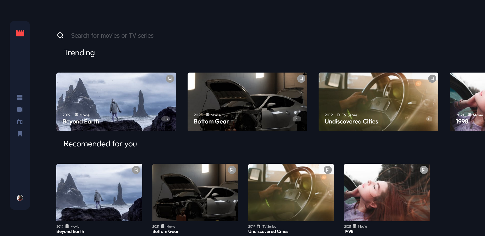

# Frontend Mentor - Dictionary web app solution

This is a solution to the [Entertainment web app](https://www.frontendmentor.io/challenges/entertainment-web-app-J-UhgAW1X/hub). Frontend Mentor challenges help you improve your coding skills by building realistic projects.

## Table of contents

- [Overview](#overview)
  - [The challenge](#the-challenge)
  - [Links](#links)
- [My process](#my-process)
  - [Built with](#built-with)
- [Author](#author)

## Overview

### The challenge

Users should be able to:

- Navigate between Home, Movies, TV Series, and Bookmarked Shows pages
- Add/Remove bookmarks from all movies and TV series
- View the optimal layout for the app depending on their device's screen size
- See hover states for all interactive elements on the page

### Screenshot

### Links

- Solution URL: [GitHub](https://github.com/waldekglaz/fem-entertainment-web-app)
- Live Site URL: [Live preview](https://fem-entertainment.netlify.app/)

## My process

### Built with

- [React](https://reactjs.org/) - JS library
- [TypeScript](https://www.typescriptlang.org/) - superset of JavaScript
- [Zustand](https://github.com/pmndrs/zustand) - A small, fast and scalable bearbones state-management solution
- [React Router v6](https://reactrouter.com/en/main) - For client side routing
- [Framer Motion](https://www.framer.com/motion/) - A production-ready motion library for React.
- [CSS Modules](https://github.com/css-modules/css-modules) - For styles scoped locally
